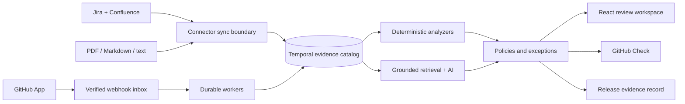

# Groundwork

Groundwork is an engineering evidence and release-readiness platform for teams shipping human- and AI-authored changes. It connects pull requests, requirements, architecture decisions, API contracts, tests, approvals, deployments, incidents, runbooks, and documents into one versioned evidence graph, then answers four practical questions:

1. Why is this change being made?
2. What can it affect?
3. What evidence says it is safe?
4. What required evidence is still missing or unknown?

The product is deliberately broader than PDF chat. Documents remain a supported evidence source, but the flagship workflow is a GitHub pull request that becomes a cited, policy-evaluated change record and, after approval, a tamper-evident release record.

## What is implemented

- GitHub App boundary with HMAC-verified, size-limited, idempotent webhook ingestion and asynchronous normalization.
- Temporal evidence catalog for GitHub, Jira, Confluence, OpenAPI, tests, builds, deployments, incidents, ADRs, runbooks, and uploaded documents.
- Durable PostgreSQL inbox/outbox, connector sync runs, cursors, retryable workers, stale-lease recovery, and reconciliation/tombstoning.
- Deterministic change analysis for intent links, changed scope, checks, tests, CODEOWNERS approval, migration rollback plans, OpenAPI removals, and API changelogs.
- Explicit evidence states: present, missing, and unknown. Missing provider data is never presented as proof of safety.
- Grounded AI analysis behind a citation-validation boundary. AI suggestions cannot override deterministic findings or become an automatic release gate.
- Versioned policies, dry-run evaluation, time-bounded exceptions, approvals, finding feedback, and signed-digest release records exportable as JSON, HTML, or PDF.
- Atlassian OAuth boundary plus selected Jira-project and Confluence-space synchronization; manual/demo ingestion works without live credentials.
- Existing PDF, Markdown, and text ingestion bridged into the same evidence catalog with hybrid PostgreSQL FTS/pgvector retrieval.
- Multi-tenant JWT security, rotating refresh tokens, workspace RBAC, encrypted/versioned connector credentials, rate limits, audit events, safe CORS, and production fail-closed validation.
- Responsive React application for dashboard, changes, evidence, connections, policies, releases, and legacy document sources.
- Prometheus metrics, OpenTelemetry/OTLP tracing, health endpoints, product-outcome analytics, CI, CodeQL, Trivy, dependency audit, and a k6 evidence-workflow scenario.

Billing remains intentionally disabled because no verified payment-provider adapter is installed.

## System shape



The backend is a modular Spring Boot monolith. PostgreSQL 16 with pgvector is the transactional source of truth; Redis accelerates caching and distributed limits. Ports isolate GitHub, Atlassian, chat, and embedding providers. Architecture rules are checked with ArchUnit.

Gemini is the default remote AI provider for both chat generation and semantic embeddings. `openai-compatible` names the HTTP protocol exposed by Gemini, not an additional OpenAI dependency. One `GEMINI_API_KEY` serves both capabilities; `EMBEDDING_API_KEY` is only an optional override for a separate Gemini project or credential.

Read the [architecture](docs/ARCHITECTURE.md), [security model](docs/SECURITY.md), [operations runbook](docs/RUNBOOK.md), [demo guide](docs/DEMO.md), [implementation report](docs/IMPLEMENTATION_REPORT.md), and [detailed 10/10 plan](GROUNDWORK_10_OUT_OF_10_PLAN.md).

## Local development

Requirements: Java 21, Node 22, PostgreSQL 16 with pgvector, and Redis 7. The deterministic adapters and seeded evidence demo do not require external AI or connector credentials.

```bash
# Start the development PostgreSQL/pgvector and Redis services:
docker compose -f compose.dev.yml up -d

./mvnw spring-boot:run

cd frontend
npm ci
npm run dev
```

Run the complete deterministic verification:

```bash
./scripts/verify.sh
```

Run the real database/pgvector tests after starting the Compose database and Redis services:

```bash
RUN_DATABASE_INTEGRATION_TESTS=true ./mvnw -Dtest=DatabaseIntegrationTest test
```

After registering, create a workspace and use **Load demo evidence** in the UI (or call `POST /api/workspaces/{workspaceId}/demo/evidence`). The seed models one API-changing pull request linked to a Jira requirement, an ADR, a previous incident, checks, ownership, and missing release evidence.

## Production-style local start

```bash
cp .env.example .env
# Replace every placeholder in .env.
docker compose config
docker compose up --build -d
```

Open `http://localhost:8081`. Compose enables the `prod` profile. Startup fails if security is disabled, CORS is wildcarded, secrets are weak/placeholders, remote embeddings are absent, enabled integrations lack credentials, or billing is enabled.

## Evaluation and performance

The deterministic analyzer has a versioned 30-scenario benchmark covering healthy, missing, unknown, and compound-risk changes:

```bash
./mvnw -Dtest=ChangeScenarioBenchmarkTest test
```

The legacy retrieval evaluation remains at `eval/run_eval.py`. Run the evidence-workflow load scenario with:

```bash
k6 run -e WORKSPACE_ID=<uuid> -e ACCESS_TOKEN=<jwt> performance/k6-smoke.js
```

Targets are not represented as measured production results. Real user interviews, live connector credentials, a deployed pilot, independent security review, restore drills, and environment-specific load reports remain external evidence gates documented in [product validation](docs/PRODUCT_VALIDATION.md).

## Project documents

- [Project assessment](PROJECT_ASSESSMENT.md)
- [Original roadmap](ROADMAP_TO_10.md)
- [10/10 product evolution and implementation plan](GROUNDWORK_10_OUT_OF_10_PLAN.md)
- [Implementation handbook](HANDBOOK.md)
- [Checked OpenAPI contract](docs/openapi.json)

## License

MIT
