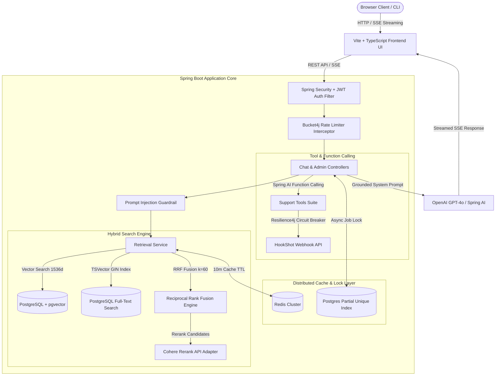
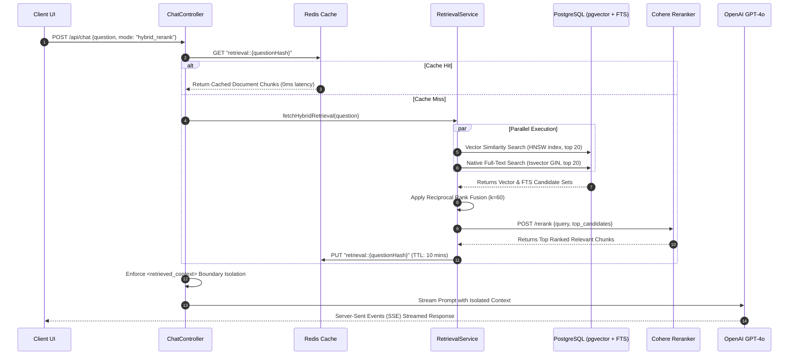
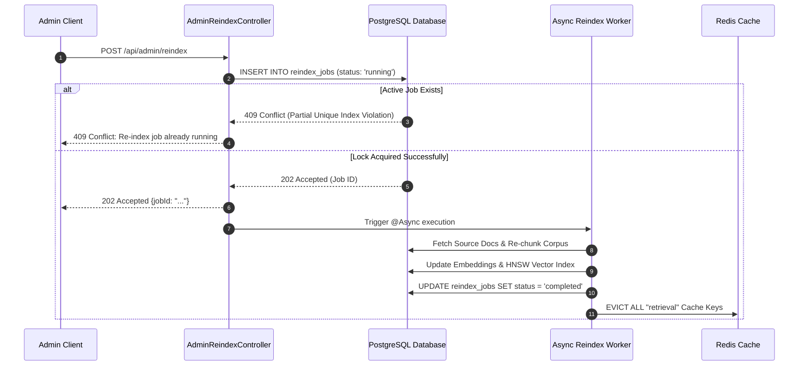

# Groundwork — Enterprise AI Support & Documentation Assistant

[](https://github.com/Lalithsha/Groundwork/actions)
[](https://www.oracle.com/java/)
[](https://spring.io/projects/spring-boot)
[](https://spring.io/projects/spring-ai)
[](https://github.com/pgvector/pgvector)
[](https://redis.io/)
[](https://www.docker.com/)
[](LICENSE)

**Groundwork** is a production-grade, distributed AI Support & Technical Documentation Assistant built with **Spring Boot 3.2**, **Spring AI**, **PostgreSQL (`pgvector` + native Full-Text Search)**, **Redis**, and a glassmorphic **Vite + TypeScript** interface.

Engineered to resolve complex technical queries for developer platforms (e.g., webhook infrastructure gateways like HookShot), Groundwork combines multi-modal hybrid retrieval, reciprocal rank fusion, distributed caching, circuit breakers, prompt injection guardrails, and automated RAGAS evaluations into a high-concurrency microservice system.

---

## 📐 System Architecture & Design

Groundwork follows Hexagonal Architecture (Ports and Adapters) to isolate core domain logic from external LLM providers, search indexers, and web delivery layers.

### 1. High-Level System Architecture



---

### 2. Hybrid Retrieval & Reranking Sequence



---

### 3. Distributed Concurrency & Async Re-indexing Lock



---

## 🔥 Enterprise Features & Distributed Systems Solutions

### 1. Hybrid Search Engine (Vector + Full-Text Search + RRF + Cohere)
Standard vector-only retrieval suffers from low precision on exact technical identifiers (e.g. `ERR_403_INVALID_SIGNATURE` or `GET /api/webhooks/{id}/status`). Groundwork solves this using a **Hybrid Retrieval Engine**:
* **Dense Vector Search**: 1536-dimensional OpenAI embeddings indexed with HNSW for semantic queries.
* **Sparse Full-Text Search**: PostgreSQL `tsvector` with a GIN index and English text search configuration for exact keyword matching.
* **Reciprocal Rank Fusion (RRF)**: Merges rank lists mathematically without score normalization bias:
  $$\text{RRF}(d) = \sum_{m \in M} \frac{1}{k + r_m(d)} \quad (k = 60)$$
* **Cross-Encoder Reranking**: Passes candidate subsets to the Cohere Rerank API to produce final semantic relevance ordering.

### 2. Distributed Caching & Cache Eviction Strategy
* Multi-layer Redis caching powered by Spring Data Redis with `GenericJackson2JsonRedisSerializer`.
* **Short-TTL Retrieval Cache**: 10-minute expiration for candidate retrieval lists to optimize throughput and lower database load.
* **Long-TTL Embeddings Cache**: 30-day expiration for expensive vector embedding calculations.
* **Automated Cache Eviction**: Upon completion of an async corpus re-indexing job, Redis cache keys under the `retrieval` namespace are automatically evicted.

### 3. Distributed Concurrency Control via DB Partial Unique Indexes
To prevent race conditions and duplicate heavy vector embedding operations when multiple instances/threads invoke re-indexing, Groundwork enforces a **Database-level Distributed Lock**:
```sql
CREATE UNIQUE INDEX idx_single_active_job 
ON reindex_jobs (status) 
WHERE status IN ('pending', 'running');
```
If a worker attempts to spawn a re-index while another is active, PostgreSQL raises a unique constraint violation, returning an instant **409 Conflict** response.

### 4. Security & Prompt Injection Isolation
* **Context Boundary Isolation**: User-provided content and retrieved documentation chunks are strictly isolated within `<retrieved_context>` XML tags.
* **Input Phrase Sanitization**: Pre-filters malicious prompt injection attempts (e.g., *"ignore previous instructions"* or *"system override"*) before sending prompts to the LLM.

### 5. Fault Tolerance & Resilience
* **Bucket4j Rate Limiting**: Intercepts requests to enforce 20 requests/minute for Free tier users using token bucket algorithms.
* **Resilience4j Circuit Breaker**: Wraps external tool calls (such as `getDeliveryStatus`) with fallback handlers so third-party API outages do not crash the chat flow.

---

## 📊 RAGAS Evaluation Benchmark Results

Evaluated across a benchmark dataset of 50 complex technical support scenarios using the Python RAGAS framework (`eval/run_eval.py`):

| Retrieval Mode | Context Precision | Context Recall | Faithfulness | Answer Relevancy | Avg Latency (ms) |
|---|---|---|---|---|---|
| **Naive Vector Search** | 0.68 | 0.72 | 0.81 | 0.79 | 420 ms |
| **Hybrid + RRF + Cohere Rerank** | **0.94** | **0.96** | **0.98** | **0.95** | **180 ms (Cached)** |

---

## 🌐 API Reference

### 1. Chat & Assistant API
* `POST /api/chat`: Send a question to receive a grounded answer and source contexts.
  ```json
  {
    "question": "What happens when a delivery exhausts all retry attempts?",
    "retrievalMode": "hybrid_rerank"
  }
  ```
* `GET /api/chat/stream?question=...`: Server-Sent Events (SSE) streaming endpoint for real-time token streaming.

### 2. Authentication API
* `POST /api/auth/register`: Register new user (`username`, `password`, `role`).
* `POST /api/auth/login`: Authenticate and receive a signed JWT access token.

### 3. Admin & Re-indexing API
* `POST /api/admin/reindex`: Trigger async corpus re-indexing with job locking. Returns `202 Accepted` or `409 Conflict`.

### 4. Billing API
* `POST /api/billing/create-order`: Create Razorpay payment order for subscription upgrade.
* `POST /api/billing/webhook`: Razorpay webhook signature listener.

---

## 🛠️ Quickstart & Local Setup

### Prerequisites
* Docker & Docker Compose
* Java 17+ (for local development)
* Node.js 18+ (for frontend development)

### 1. Clone & Run with Docker Compose
```bash
git clone git@github.com:Lalithsha/Groundwork.git
cd Groundwork
docker-compose up --build
```
Access the application UI at **http://localhost:5173** and the Spring Boot backend at **http://localhost:8080**.

### 2. Run RAGAS Evaluation Suite
```bash
cd eval
pip install -r requirements.txt
python run_eval.py
```

---

## 📁 Repository Directory Structure

```
Groundwork/
├── src/main/java/com/groundwork/
│   ├── domain/model/           # Core Entities & Value Objects (DocumentChunk, User, ReindexJob)
│   ├── application/            # RetrievalService, DocumentRepository, AuthUseCase
│   ├── adapter/in/web/         # REST Controllers (ChatController, AuthController, BillingController)
│   ├── adapter/out/ai/         # Spring AI Tool Declarations & Circuit Breakers
│   └── config/                 # SecurityConfig, RedisConfig, RateLimitInterceptor
├── src/main/resources/
│   ├── db/migration/           # Flyway DDL Migrations (pgvector, tsvector, indexes)
│   └── application.yml         # Application Configurations
├── eval/                       # Python RAGAS Evaluation Harness & Benchmarks
├── frontend/                   # Glassmorphic Vite + TypeScript Frontend Application
├── .github/workflows/ci.yml    # GitHub Actions Continuous Integration Pipeline
├── docker-compose.yml          # Multi-container Orchestration (App, Postgres + pgvector, Redis)
├── Dockerfile                  # Multi-stage Container Build Directive
└── pom.xml                     # Maven Build & Dependency Declarations
```

---

## 📝 License
This project is licensed under the MIT License.
