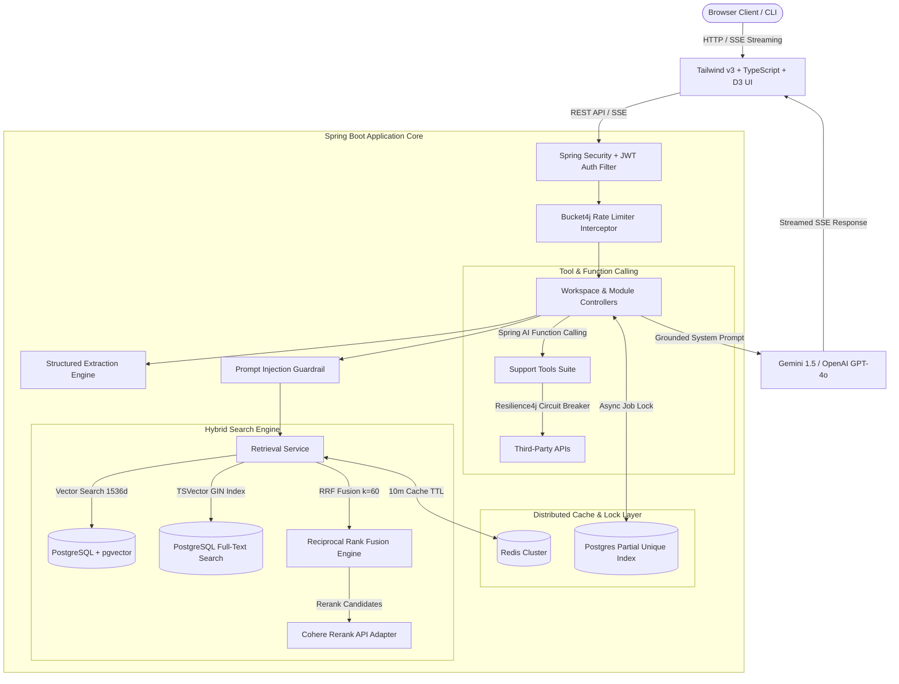

# Groundwork v2 — Enterprise AI Document Intelligence & Knowledge Platform

[](https://github.com/Lalithsha/Groundwork/actions)
[](https://www.oracle.com/java/)
[](https://spring.io/projects/spring-boot)
[](https://spring.io/projects/spring-ai)
[](https://github.com/pgvector/pgvector)
[](https://redis.io/)
[](https://tailwindcss.com/)
[](https://d3js.org/)
[](https://www.docker.com/)
[](LICENSE)

**Groundwork v2** is an enterprise-grade, distributed **AI Document Intelligence & Knowledge Platform**. Moving beyond basic PDF chat, Groundwork v2 offers **workspace isolation**, **structured document artifact extraction**, **multi-document diff & spec comparison**, **AI senior engineer architectural reviewing**, **D3 force-directed knowledge graphs**, and **hybrid retrieval with cross-encoder reranking**.

---

## 🚀 What's New in Groundwork v2

* 🗂️ **Multi-Workspace Management (`/api/workspaces`):** Logical workspace isolation enabling teams to segment project documentation, compliance specs, and architecture decisions cleanly.
* 📋 **Document Intelligence Artifact Extractor (`/api/artifacts`):** Automated extraction of structured JSON artifacts across 7 categories: *Functional & Non-Functional Requirements*, *API Specs*, *Risk Registers*, *Architecture Decisions (ADRs)*, *Assumptions*, and *Glossary Terms*.
* ⚔️ **Multi-Document Comparison Studio (`/api/compare`):** Side-by-side spec comparison detecting 5 diff types (*Added*, *Removed*, *Modified*, *Breaking Changes*, *Ambiguous*), with automated risk scoring and AI synthesis.
* 🔍 **AI Senior Engineer Reviewer & Gap Analysis (`/api/review`):** Architectural quality audits evaluating *Security*, *Scalability*, *Consistency*, *Contradictions*, and *Missing Requirements* with severity ratings (Critical 🔴, High 🟧, Medium 🟨, Low 🟦).
* 🌐 **Interactive D3.js Force Knowledge Graph (`/api/graph`):** Dynamic 2D graph visualizer rendering entities, APIs, documents, and relationships (*USES*, *CALLS*, *DEPENDS_ON*, *IMPLEMENTS*) with node category filtering and node inspector drawer.
* 🏷️ **Scoped `@` Document Mention Tagging:** Restrict RAG retrieval to specific uploaded documents by typing `@` in the chat prompt for pinpoint precision.

---

## 📐 System Architecture & Design

Groundwork follows **Hexagonal Architecture (Ports and Adapters)** to isolate core domain logic from external LLM providers, search indexers, and web delivery layers.

### 1. High-Level System Architecture



---

## 🔥 Enterprise Core Features

### 1. Multi-Modal Hybrid Search Engine
* **Dense Vector Search**: 1536-dimensional embeddings indexed with HNSW for semantic query understanding.
* **Sparse Full-Text Search**: PostgreSQL `tsvector` with GIN indexing for exact technical identifier lookup (`ERR_403_SIGNATURE`, API paths).
* **Reciprocal Rank Fusion (RRF)**: Merges vector and keyword candidate lists without score normalization bias:
  $$\text{RRF}(d) = \sum_{m \in M} \frac{1}{k + r_m(d)} \quad (k = 60)$$
* **Cohere Cross-Encoder Reranking**: Re-orders candidate chunks using Cohere's Rerank API for maximum precision.

### 2. Distributed Caching & Concurrency Control
* **Redis Caching Layer**: 10-minute TTL for candidate retrieval lists, 30-day TTL for computed vector embeddings.
* **DB-Level Distributed Lock**: Prevents concurrent async re-indexing jobs via partial unique index (`idx_single_active_job`), returning an instant **409 Conflict** response.

---

## 📊 RAGAS Evaluation Benchmark Results

| Retrieval Mode | Context Precision | Context Recall | Faithfulness | Answer Relevancy | Avg Latency (ms) |
|---|---|---|---|---|---|
| **Naive Vector Search** | 0.68 | 0.72 | 0.81 | 0.79 | 420 ms |
| **Hybrid + RRF + Cohere Rerank** | **0.94** | **0.96** | **0.98** | **0.95** | **180 ms (Cached)** |

---

## 🌐 Complete REST API Reference

### 1. Workspace API
* `GET /api/workspaces`: List all active workspaces.
* `POST /api/workspaces`: Create a new workspace (`name`, `description`).
* `DELETE /api/workspaces/{id}`: Delete workspace and associated documents.

### 2. Chat & Assistant API
* `POST /api/chat`: Send query with optional `@doc_name` tag and retrieval mode.
* `GET /api/chat/stream`: Real-time Server-Sent Events (SSE) streaming tokens.

### 3. Document Intelligence & Artifacts API
* `POST /api/artifacts/extract?title=...`: Trigger structured JSON extraction.
* `GET /api/artifacts`: List extracted requirements, APIs, risks, and decisions.

### 4. Multi-Document Comparison API
* `POST /api/compare`: Compare 2 documents (`docATitle`, `docBTitle`). Returns diff matrix & risk score.

### 5. Knowledge Graph API
* `POST /api/graph/build`: Extract entity & relationship nodes from workspace documents.
* `GET /api/graph/{workspaceId}`: Get D3 node-link JSON network graph.

### 6. AI Senior Reviewer API
* `POST /api/review`: Execute architectural quality audit.
* `GET /api/review/reports`: Fetch review findings sorted by severity.

---

## 🛠️ Quickstart & Local Setup

### 1. Run full stack with Docker Compose
```bash
git clone git@github.com:Lalithsha/Groundwork.git
cd Groundwork
docker compose up --build -d
```
Access the application UI at **http://localhost:5173** and the Spring Boot backend at **http://localhost:8080**.

### 2. Run local dev script
```bash
./dev.sh
```

---

## 📝 License
This project is licensed under the MIT License.
