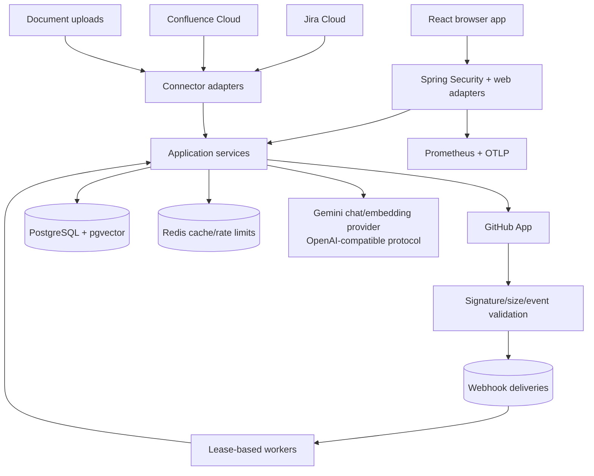
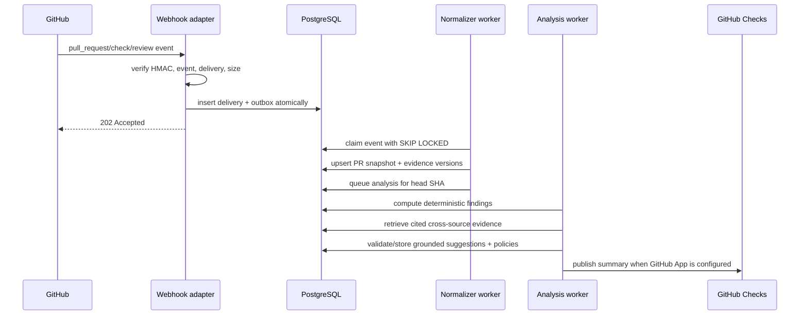

# Groundwork architecture

## Product boundary

Groundwork turns engineering-system facts into evidence-backed change and release records. The system owns normalization, evidence versioning, deterministic checks, grounded suggestions, policy results, feedback, and release snapshots. GitHub, Jira, Confluence, model providers, and notification surfaces remain external systems behind ports.

## Runtime view

## Code boundaries

- `evidence/domain`: immutable change, evidence, connector, policy, finding, and release records.
- `evidence/application`: use cases, deterministic analysis, orchestration, repositories, indexing, policy and release logic.
- `evidence/application/port/out`: source-control, knowledge-source, and OAuth contracts.
- `evidence/adapter/in/web`: authenticated HTTP translation and validation.
- `evidence/adapter/out`: GitHub and Atlassian implementations.
- `application` and legacy adapters: durable document ingestion, hybrid retrieval, and grounded document workflows retained as an evidence source.
- Flyway: additive data contracts. ArchUnit prevents domain-to-framework and application-to-concrete-adapter coupling.

## Temporal evidence model

An `evidence_artifact` is a stable identity: for example Jira issue `PROJ-42`, GitHub PR `acme/api#42`, or ADR-019. Every changed content digest creates an immutable `evidence_artifact_version`. Relationships connect artifact identities with typed edges such as `IMPLEMENTS`, `REFERENCES`, `GOVERNED_BY`, and `AFFECTS`.

Connector sync runs mark artifacts seen in a particular complete scan. Only a failure-free reconciliation may mark unseen artifacts inaccessible; partial syncs never erase evidence. Revocation removes credentials and marks connector-owned artifacts inaccessible without deleting their audit history.

## GitHub event sequence

Delivery IDs are unique. Payload digests detect conflicting replay. Workers have bounded attempts and stale-lease recovery. Reanalysis is keyed to the current head SHA and analyzer version.

## Deterministic/AI boundary

Deterministic analyzers produce high-confidence facts for paths, checks, tests, CODEOWNERS, migration rollback evidence, OpenAPI removals, and changelog requirements. Every result carries present/missing/unknown state.

AI receives only retrieved evidence with citation IDs. Its structured response is rejected or downgraded if citations do not exist, claims are unsupported, or the provider fails. AI output is always a suggestion and cannot change deterministic policy truth. This decision is formalized in ADR 0003.

## Persistence and consistency

PostgreSQL is authoritative for tenants, credentials (ciphertext only), sync runs, inbox/outbox, artifacts/versions/edges, change sets, jobs, findings, policy evaluations, feedback, exceptions, approvals, releases, audit logs, document chunks, and vector indexes. Mutations that require asynchronous work write their event in the same transaction.

Redis is disposable: it stores cache and distributed rate-limit state, not authoritative product records. Provider API calls are outside database transactions; durable run/job state records their outcome.

## Release integrity

Creating a release record snapshots selected changes, policy results, approvals, and evidence-item digests. Verification recalculates digests and reports post-freeze changes. JSON is the canonical export; HTML and PDF are presentation formats generated from the same record.

## Scale posture

The initial topology is a modular monolith plus worker threads, PostgreSQL, and Redis. Horizontal API/worker replicas are safe because claims use row locks and unique idempotency constraints. Kafka, a separate graph database, Kubernetes, and microservices require measured evidence that the current model cannot meet throughput, isolation, or team-ownership needs. See ADR 0002.
